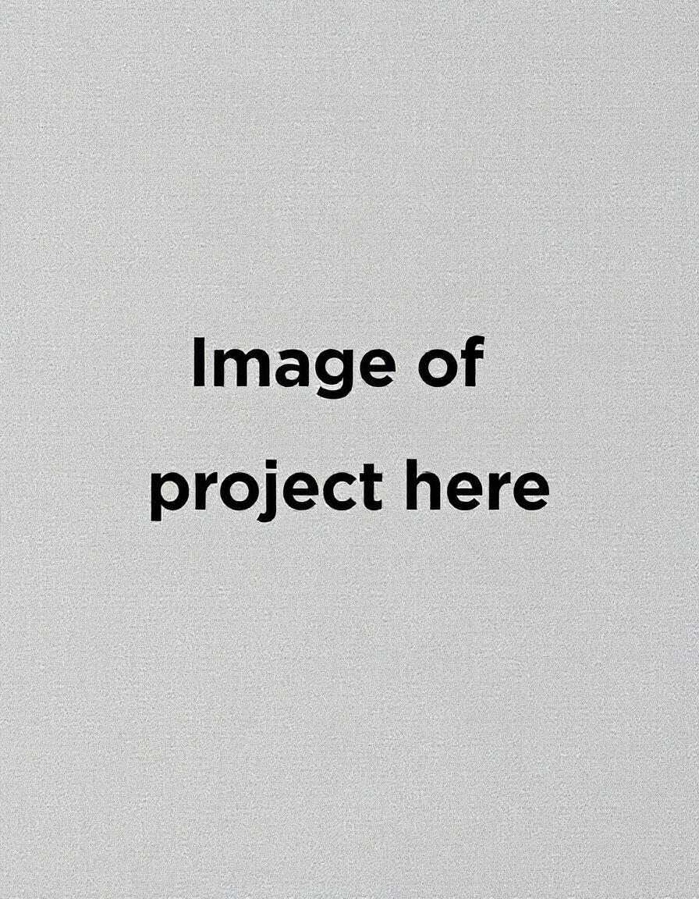

# Readme-template
Meu modelo de Readme.md para meus repositorios.
<br />
<br />

# Titulo do projeto

<p align="center">
	
	
	
</p>



## 🔗 Sumário

- [📍 Sobre](#-sobre)
- [⌛ Melhorias futuras](#-melhorias-futuras)
- [👾 Funcionalidades](#-funcionalidades)
- [💻 Tecnologias](#-tecnologias)
- [📁 Estrutura do projeto](#-estrutura-do-projeto)
- [🚀 Início](#-início)
  - [📝 Pré-requisitos](#-pré-requisitos)
  - [🔧 Instalação](#-instalação)
  - [🤖 Como usar](#-como-usar)

## 📍 Sobre

Descrição do projeto

Caso o projeto ainda esteja em desenvolvimento
## 📌 Melhorias futuras
O projeto ainda está em desenvolvimento e as próximas atualizações serão focadas nos seguintes aspectos:

- [ ] **`Task 1`**: Adicionar sistema de login;

## 👾 Funcionalidades

<ul>
 <li>Feature 1</li>
 <li>Feature 2</li>
 <li>Feature 3</li>
 <li>Feature 4</li>
 <li>Feature 5</li>
 <li>Feature 6</li>
</ul>

## 💻 Tecnologias

- **Frontend**: Techs front
 - **Backend**: Techs back
 - **DataBase**: database

## 📁 Estrutura do Projeto
Exemplo de estrutura: 
```sh
└── Management-tasks.git/
    ├── README.md
    ├── client
    │   ├── .env.local
    │   ├── .eslintrc.json
    │   ├── .gitignore
    │   ├── .prettierrc
    │   ├── README.md
    │   ├── app
    │   ├── components
    │   ├── next.config.mjs
    │   ├── package-lock.json
    │   ├── package.json
    │   ├── postcss.config.mjs
    │   ├── public
    │   ├── state
    │   ├── tailwind.config.ts
    │   └── tsconfig.json
    └── server
        ├── .env
        ├── .gitignore
        ├── client.http
        ├── dist
        ├── package-lock.json
        ├── package.json
        ├── prisma
        ├── src
        └── tsconfig.json
```

## 🚀 Início

### 📝 Pré-requisitos
Antes de iniciar o projeto é necessário que você atenda aos seguintes pré requisitos:

- Ter o <a href="https://nodejs.org/en">Node.js</a> instalado na máquina. 

### 🔧 Instalação

Passo a passo para instalar e usar o projeto:

1. Clone o repositório para sua máquina
```sh
❯ git clone https://github.com/Albert1616/Management-tasks.git
```

### 🤖 Como usar
Passo a passo para executar o projeto
</br>
**Using `npm`** &nbsp; [](https://www.npmjs.com/)
```sh
❯ npm run dev
```

